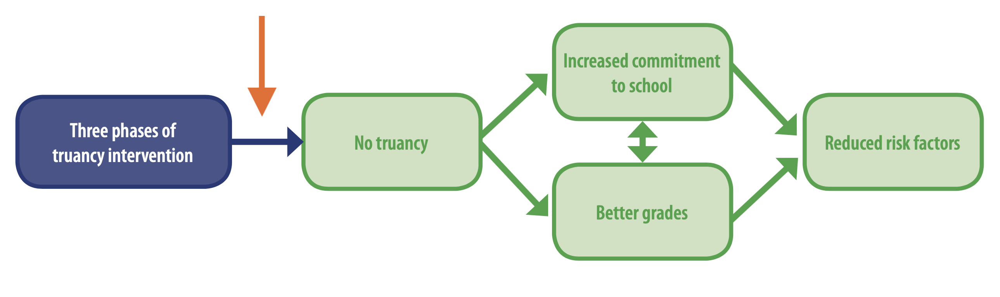
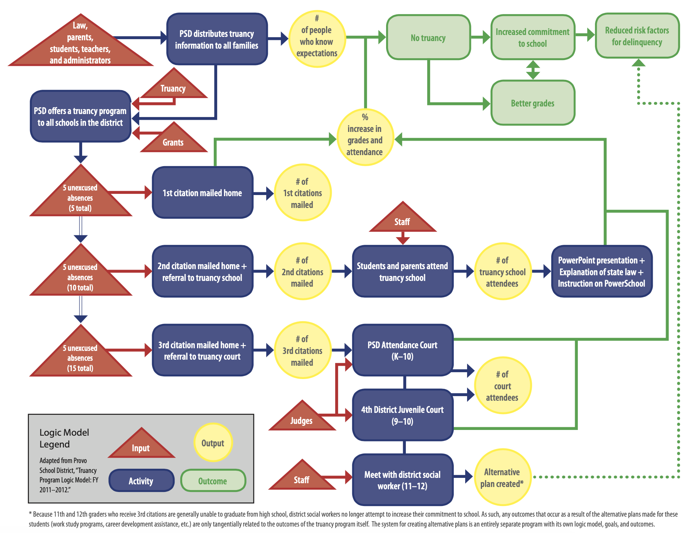

```{r setup, include=FALSE}
knitr::opts_chunk$set(warning = FALSE, message = FALSE, 
                      fig.retina = 3, fig.align = "center")
```

```{r packages-data, include=FALSE}
library(tidyverse)
library(ggdag)
library(palmerpenguins)
library(modelsummary)
```

```{r xaringanExtra, echo=FALSE}
xaringanExtra::use_xaringan_extra(c("tile_view"))
```

class: center middle main-title section-title-3

# In-person<br>session 3

.class-info[

**January 30, 2025**

.light[PMAP 8521: Program evaluation<br>
Andrew Young School of Policy Studies
]

]

---

name: outline
class: title title-inv-8

# Plan for today

.box-4.medium[{ggplot2} and {dplyr}]

--

.box-1.medium[Logic models and evaluation]

--

.box-5.medium[Regression FAQs]

---

layout: false
name: regression
class: center middle section-title section-title-4 animated fadeIn

# {ggplot2} and {dplyr}

---

layout: false
name: logic-models
class: center middle section-title section-title-1 animated fadeIn

# Logic models<br>and evaluation

---

layout: true
class: middle

---

.box-1.large[Logic models as managerial tools]

---

.box-1.large[Inputs vs. Activities vs.<br>Outputs vs. Outcomes]

---

.box-1.large[Impact theory vs. logic model]

---

layout: false
class: title title-1

# Impact theory

.box-inv-1[Ensure that the theory linking activities to the outcomes is sound!]

.center[
<figure>
  
</figure>
]

---

.center[
<figure>
  
</figure>
]

---

layout: false
class: title title-1

# MPA/MPP at GSU

.pull-left[
<figure>
  
</figure>
]

.pull-right[
<figure>
  
</figure>
]

???

Inputs:

- Students
- Curriculum
- Money (grants, tuition)
- AYSPS itself
- Faculty, staff
- Technology (iCollege, PAWS)
- Infrastructure
- Transportation
- State regulations
- National accreditation standards
- Faculty research

Activities:

- Classes
- Group work
- Exams
- Internships
- Job fairs
- Commencement
- Studying
- Tutoring
- Office hours
- Advising
- Attendance

Outputs:

- Assignments and projects
- Grades
- Degree
- Jobs
- Awards
- Network
- Debt

Outcomes:

- Leadership
- AYS national ranking
- Public service motivation
- Critical thinking
- Efficient workforce
- Income
- Better society

---

layout: true
class: middle

---

.box-1.medium[Do people really have the<br>job title "program evaluator"?] 

--

.box-1.medium[How much does this evaluation stuff cost?] 

--

.box-1.medium[Can you do scaled-down versions<br>of these evaluations?]

???

<https://www.eval.org/>

---

.box-1.medium[Isn't it best to always<br>have an articulated theory?] 

.box-1.medium[Should implicit theory and articulated theory<br>be the same thing in most cases?]

---

.box-1.medium[What if a program exists already<br>and doesn't have a logic model?] 

---

.box-1.medium[Why would a program aim for final outcomes<br>that can't be measured?]

---

.box-1.medium[What should you do if you find that your<br>theory of change (or logic model in general)<br>is wrong in the middle of the program?<br>Is it ethical to stop or readjust?]

---

.box-1.medium[How does regression<br>relate to impact evaluation?]

---

layout: false
name: regression-faqs
class: center middle section-title section-title-5 animated fadeIn

# Regression FAQs

---

layout: true
class: middle

---

.box-5.medium[Do we care about the actual coefficients<br>or just whether or not they're significant?]

--

.box-5.medium[How does significance relate to causation?]

--

.box-5.medium[If we can't use statistics to assert causation<br>how are we going to use this information<br>in program evaluation?]

---

.box-5.large[What counts as a "good" R²?]

---

.center[
<figure>
  
</figure>
]

---

.center[
<figure>
  
</figure>
]

---

.center[
<figure>
  
</figure>
]

---

.center[
<figure>
  
</figure>
]

---

class: middle

.box-5.large[Side-by-side regression tables]

---

```{r echo=FALSE, warning=FALSE, results="asis"}
model1 <- lm(body_mass_g ~ bill_length_mm, data = penguins)
model2 <- lm(body_mass_g ~ flipper_length_mm, data = penguins)
model3 <- lm(body_mass_g ~ bill_length_mm + flipper_length_mm, data = penguins)
model4 <- lm(body_mass_g ~ bill_length_mm + flipper_length_mm + sex, data = penguins)

modelsummary(list(model1, model2, model3, model4),
             stars = TRUE,
             output = "gt")
```

---

class: middle

.box-5.large[See full documentation and<br>examples for `modelsummary()` [here](https://vincentarelbundock.github.io/modelsummary/articles/modelsummary.html)]

---

class: middle

.box-5.large[Make nicer tables [with {tinytable}](https://vincentarelbundock.github.io/tinytable/)]
