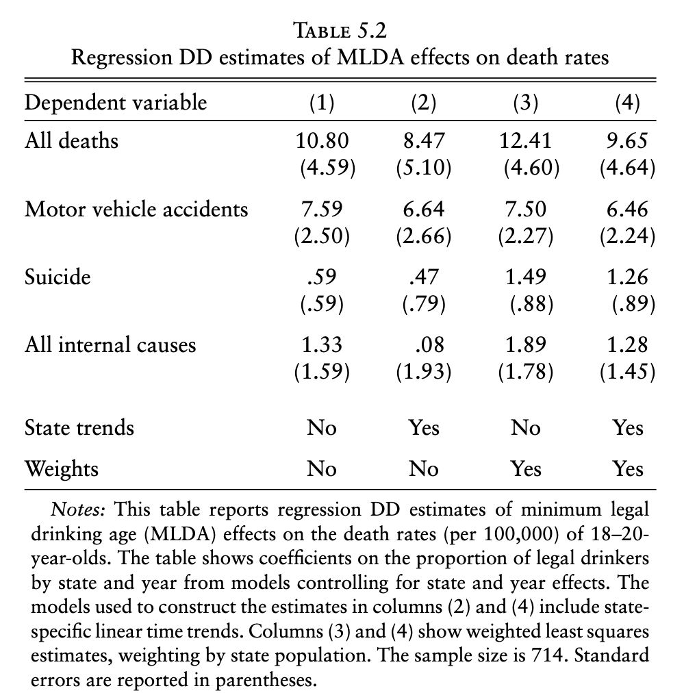

```{r setup, include=FALSE}
knitr::opts_chunk$set(warning = FALSE, message = FALSE, 
                      fig.retina = 3, fig.align = "center")
```

```{r packages-data, include=FALSE}
library(tidyverse)
library(ggdag)
library(palmerpenguins)
library(modelsummary)
```

```{r xaringanExtra, echo=FALSE}
xaringanExtra::use_xaringan_extra(c("tile_view"))
```

class: center middle main-title section-title-3

# In-person<br>session 9

.class-info[

**March 13, 2025**

.light[PMAP 8521: Program evaluation<br>
Andrew Young School of Policy Studies
]

]

---

name: outline
class: title title-inv-8

# Plan for today

--

.box-2.medium.sp-after-half[Diff-in-diff II]

--

.box-5.medium.sp-after-half[LLMs]

--

.box-6.medium.sp-after-half[Quarto websites<br>(and other fun)]

---

layout: false
name: diff-in-diff
class: center middle section-title section-title-2 animated fadeIn

# Diff-in-diff II

---

.center[
<figure>
  
</figure>
]

---

class: middle

.pull-left[
.box-2.medium[**1849**]

.box-2[Cholera deaths per 100,000]

.box-inv-2[Southwark & Vauxhall: **1,349**]

.box-inv-2[Lambeth: **847**]

]

.pull-right[
.box-2.medium[**1854**]

.box-2[Cholera deaths per 100,000]

.box-inv-2[Southwark & Vauxhall: **1,466**]

.box-inv-2[Lambeth: **193**]
]

---

.center[
<figure>
  
</figure>
]

---

.center[
<figure>
  
</figure>
]

---

layout: true
class: middle

---

.box-2.medium[When doing your subtracting to get<br>your differences in the matrix, is it better <br>to do the vertical or horizontal subtractions?]

.box-2.medium[Are there situations where<br>one is preferable to the other?]

---

.box-2.medium[Why are we learning<br>two ways to do diff-in-diff?<br>(2x2 matrix vs. `lm()`)]

---

.box-2.large[What happened to confounding??]

.box-2.medium[Now we're only looking<br>at just two "confounders"?]

.box-2.medium[Should we still control for things?]

???

The parallel trends assumption takes care of that

---


.box-2.large[DIDID(IDIDID)?]

---

.box-2.medium[The effect of mandatory<br>maternity benefits on wages]

.box-inv-2.medium[New Jersey implements policy;<br>Pennsylvania doesn't]

.box-inv-2.medium[Only applies to married women who have kids]

---

.box-inv-2.medium[Married women 20–40 - <br>single men/unmarried women/older women<br>in NJ and PA]

---

.center[
<figure>
  
</figure>
]

???

- <https://causalinf.substack.com/p/triple-differences-part-1>
- <https://causalinf.substack.com/p/triple-difference-part-3-triple-differences>

---

.box-2.large[Can you walk through an example of<br>diff-in-diff in class?]

---

.box-2.large[Two-way fixed effects<br>(TWFE)]

---

.box-2.medium[Two states: Alabama vs. Arkansas]

$$\begin{aligned}
\text{Mortality}\ =&\ \beta_0 + \beta_1\ \text{Alabama} + \beta_2\ \text{After 1975}\ + \\
&\ \beta_3\ (\text{Alabama} \times \text{After 1975})
\end{aligned}$$

---

.box-2.medium[All states: `Treatment == 1`<br>if legal for 18-20-year-olds to drink]

$$\text{Mortality}\ =\ \beta_0 + \beta_1\ \text{Treatment} + \beta_2\ \text{State} + \beta_3\ \text{Year}$$

---

$$\begin{aligned}
\text{Mortality}\ =&\ \beta_0 + \beta_1\ \text{Alabama} + \beta_2\ \text{After 1975}\ + \\
&\ \color{red}{\beta_3}\ (\text{Alabama} \times \text{After 1975})
\end{aligned}$$

.center[vs.]

$$\text{Mortality}\ =\ \beta_0 + \color{red}{\beta_1}\ \text{Treatment} + \beta_2\ \text{State} + \beta_3\ \text{Year}$$

---

$$\begin{aligned}
\text{Mortality}\ =&\ \beta_0 + \beta_1\ \text{Alabama} + \beta_2\ \text{After 1975}\ + \\
&\ \color{red}{\beta_3}\ (\text{Alabama} \times \text{After 1975})
\end{aligned}$$

.center[vs.]

$$\text{Mortality}\ =\ \beta_0 + \color{red}{\beta_1}\ \text{Treatment} + \beta_2\ \text{State} + \beta_3\ \text{Year}$$

.center[vs.]

$$\begin{aligned}
\text{Mortality}\ =\ & \beta_0 + \color{red}{\beta_1}\ \text{Treatment} + \beta_2\ \text{State} + \beta_3\ \text{Year}\ +\\
&\beta_4\ (\text{State} \times \text{Year})
\end{aligned}$$

---

.center[
<figure>
  
</figure>
]

---

$$\begin{aligned}
\text{Donation rate}\ =&\ \beta_0 + \beta_1\ \text{California} + \beta_2\ \text{After Q22011}\ + \\
&\ \beta_3\ (\text{California} \times \text{After Q22011})
\end{aligned}$$

.center[vs.]

$$
\begin{aligned}
\text{Donation rate}\ =\ & \beta_0 + \color{red}{\beta_1}\ \text{Treatment}\ + \\
& \beta_2\ \text{State} + \beta_3\ \text{Quarter}
\end{aligned}
$$

---

.box-2.large[What about this<br>staggered treatment stuff?]

.box-inv-2[[See this](https://www.andrewheiss.com/blog/2021/08/25/twfe-diagnostics/)]

???

This is good for ethical reasons!

Blog post

---

layout: false
name: llms
class: center middle section-title section-title-5 animated fadeIn

# LLMs

---

layout: true
class: middle

---

.box-5.medium[How have you used LLMs like ChatGPT?]

.box-5.medium[What worries have you had?]

---

.box-5.medium[Can we use LLMs like ChatGPT?]

.box-5.medium[How do we use them?]

.box-5.medium[Is it okay to use them?]

---

.box-5.medium[LLMs are not magical. They're stats.]

---

.box-5.large[Basic Markov chain<br>example with R]

---

.center[
<iframe width="800" height="450" src="https://www.youtube.com/embed/LPZh9BOjkQs" frameborder="0" allow="accelerometer; autoplay; encrypted-media; gyroscope; picture-in-picture" allowfullscreen></iframe>
]

---

.box-5.large[LLMs are essentially<br>*super fancy* Markov chains]

.box-inv-5.small["Stochastic parrots" and "fancy autocorrect"]

---

.box-5.large[Average output]

---

.box-5.large[Reasoning models]

---

layout: true
class: title title-inv-5

---

# So many ethical issues!

.pull-left.center[
.box-5.less-medium[Environmental concerns]

.tiny.center[["Environmental Impact of Large Language Models"](https://www.cutter.com/article/environmental-impact-large-language-models) and<br>["The mounting human and environmental costs of generative AI"](https://arstechnica.com/gadgets/2023/04/generative-ai-is-cool-but-lets-not-forget-its-human-and-environmental-costs/) and ["AI water footprint suggests that large language models are thirsty"](https://techhq.com/2023/04/ai-water-footprint-suggests-that-large-language-models-are-thirsty/)]

.box-5.less-medium[Human toll]

.tiny.center[["OpenAI Used Kenyan Workers on Less Than $2 Per Hour to Make ChatGPT Less Toxic"](https://time.com/6247678/openai-chatgpt-kenya-workers/)]

.box-5.less-medium[Racial and gender bias]

.tiny.center[["AI chatbots use racist stereotypes even after anti-racism training"](https://www.newscientist.com/article/2421067-ai-chatbots-use-racist-stereotypes-even-after-anti-racism-training/)]

]

.pull-right[
.box-5.less-medium[Stolen training data]

.tiny.center[["ChatGPT Stole Your Work. So What Are You Going to Do?"](https://www.wired.com/story/chatgpt-generative-artificial-intelligence-regulation/) and ["Congress Wants Tech Companies to Pay Up for AI Training Data"](https://www.wired.com/story/congress-senate-tech-companies-pay-ai-training-data/) and ["ChatGPT can leak training data, violate privacy"](https://www.zdnet.com/article/chatgpt-can-leak-source-data-violate-privacy-says-googles-deepmind/)]

.box-5.less-medium[Ouroboros effect]

.tiny.center[["Meet the Serbian DJ Running an AI Clickbait Business"](https://www.wnycstudios.org/podcasts/otm/segments/serbian-dj-internet-ai-clickbait-on-the-media) and ["The Perfect Webpage"](https://www.theverge.com/c/23998379/google-search-seo-algorithm-webpage-optimization)]

.box-5.less-medium[Making stuff up]

.tiny.center[["AI models make stuff up. How can hallucinations be controlled?"](https://www.economist.com/science-and-technology/2024/02/28/ai-models-make-stuff-up-how-can-hallucinations-be-controlled)]
]

???

<https://www.thehairpin.com/>

---

# Just this week!

.center[
<figure>
  
</figure>
]

???

https://arstechnica.com/tech-policy/2025/03/openai-urges-trump-either-settle-ai-copyright-debate-or-lose-ai-race-to-china/

---

# Just this week!

.center[
<figure>
  
</figure>
]

???

https://www.nytimes.com/2025/03/12/us/yale-suspends-scholar-terrorism.html - https://archive.is/Oxt6U

---

# Just this week!

.center[
<figure>
  
</figure>
]

???

https://www.axios.com/2025/03/06/state-department-ai-revoke-foreign-student-visas-hamas

---

layout: false
class: middle

.box-5.large[You need to figure out<br>your own ethics.]

---

layout: true
class: title title-inv-5

---

# LLMs and programming

.box-5.medium[GitHub Copilot tuned specifically for code]

.box-5.small[Uses ChatGPT, Claude, or Gemini behind the scenes]

.box-5.small[You can also use Claude, DeepSeek, etc. directly instead of from GitHub]

--

.box-5.medium[These work *surprisingly* well]

--

.box-inv-5.medium[But they're dangerous if you<br>don't know what you're doing!]

---

# Getting coding help from LLMs

.box-5.medium[Talking to LLMs for code requires<br>special skills and practice!]

--

.box-5.medium[Think about coverage]

--

.box-5.medium[***Rep***roducible ***ex***amples!]

.small.center[[Reprex slides](https://datavizf23.classes.andrewheiss.com/slides/08-slides.html#15)]

.box-inv-5.smal[[GitHub Gists](https://gist.github.com/)]

---

# Things code-focused LLMs are good at

.box-5.medium[Explaining and annotating code]

.box-5.medium[Translating between languages]

.box-5.medium[Generating boilerplate/starter code]

.box-5.medium[Cleaning and rewriting code]

--

.box-inv-5[BUT .smaller[(and I cannot emphasize this enough)]<br>THEY ARE STILL CONFIDENTLY WRONG]

---

layout: false
class: middle

.box-5.huge[Demonstration!]

---

layout: false
name: quarto
class: center middle section-title section-title-6 animated fadeIn

# Quarto websites<br>(and other fun)
